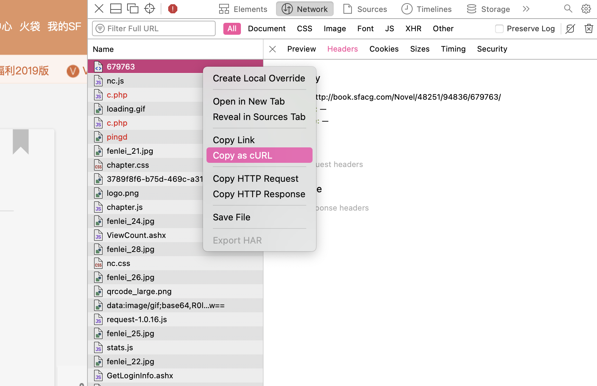
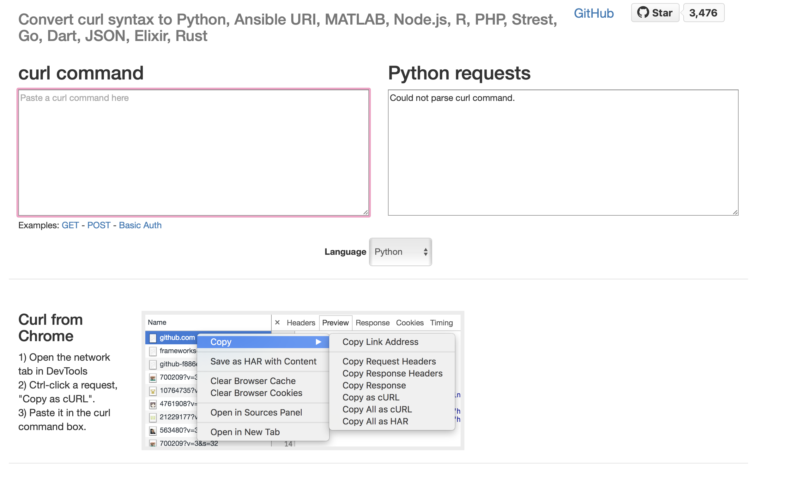
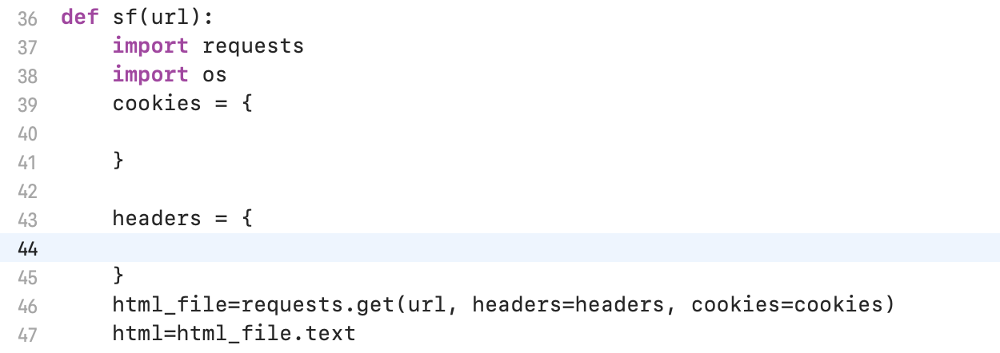

# SFacgSpider
### 基于Python的SF轻小说爬虫
#### 感谢[github.com/mwx2006/SFacg-Book](https://github.com/mwx2006/SFacg-Book)
---
## 环境需求
<ul>
<li>**Python3.8**</li>
<li>**ffmpeg**</li>
</ul>

### 依赖包

<ul>
<li>**urllib**</li>
<li>**request**</li>
<li>**os**</li>
</ul>

## 使用
##### 保姆级教程
### 0x01

打开一篇你想下载的小说，在控制台中右键Copy as cURL
### 0x02

cURL命令粘贴在左侧 右侧获取cookies = {} 与 headers ={}
### 0x03

贴进去
### 0x04
创建一个目录，把SFacgSpider.py丢进去
在刚刚创建的目录中创建子目录img与付费文章子目录vimg

自动模式将全书第一章链接输入即可全部下载（前提需购买相应文章
手动模式就不说了233

免费图像与付费文章中图像都会下载并已Markdown语法插入相应的文章中
一篇文章中的免费图像不超过5张应该不会出问题（超过五张自己改
付费文章的内容为gif格式的大图片，为了兼容大部分MD阅读器使用了ffmpeg自动转码

## 请勿用做盗版